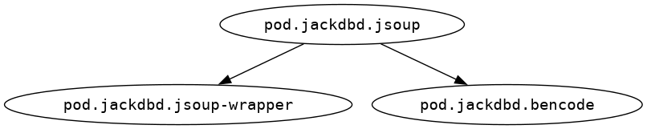

# pod-jackdbd-jsoup


[](https://clojars.org/com.github.jackdbd/pod.jackdbd.jsoup)

Babashka pod for parsing HTML with [jsoup](https://jsoup.org/).

## How to use it?

### Use the binary file for your OS/architecture

If you want to load a version of this pod that was *registered* on the [Pod registry](https://github.com/babashka/pod-registry) (see below to know what *registered* means in this context), you can do it using the **qualified keyword** of this pod.

```clj
(require '[babashka.pods :as pods])
(pods/load-pod 'com.github.jackdbd/pod.jackdbd.jsoup "0.3.0")
```

Whether the pod is *registered* or not, you can always load it with this method:

1. Download the archive (e.g. `.zip`) containing the pod binary for your OS/architecture from a [GitHub release](https://github.com/jackdbd/pod-jackdbd-jsoup/releases).
1. Extract the binary from the archive (e.g. `unzip` it).

And either (option A):
1. Move the binary to your [`BABASHKA_PODS_DIR`](https://github.com/babashka/pods?tab=readme-ov-file#where-does-the-pod-come-from).
1. Load the pod using its **file name**.

```clj
(require '[babashka.pods :as pods])
(pods/load-pod "pod-jackdbd-jsoup")
```

Or (option B):

1. Move the binary whenever you want on your filesystem.
1. Load the pod using its **file path**.

```clj
(require '[babashka.pods :as pods])
(pods/load-pod "/path/to/pod-jackdbd-jsoup")
```

### Use the uberjar

In case the pod wasn't compiled for your combination of OS/architecture, you can still use it with this method:

1. Download the uberjar from a [GitHub release](https://github.com/jackdbd/pod-jackdbd-jsoup/releases).
1. Load the pod using its **file path**.

```clj
(require '[babashka.pods :as pods])
(def uber-file "path/to/pod-jackdbd-jsoup.jar")
(pods/load-pod ["java" "-jar" uber-file])
```

See also [examples/jsoup.bb](./examples/jsoup.bb).

## Development

The file [`devenv.nix`](./devenv.nix) declares a developer environment for this project. This file is used by [devenv](https://github.com/cachix/devenv) to create such environment. If you don't use devenv you can ignore this file, or use it to understand which dependencies are required by this project.

This project uses a [`bb.edn`](./bb.edn) file to define a few [Babashka tasks](https://book.babashka.org/#tasks). You can type `bb tasks` to view them.

### Linux binary

If you are on Linux, you can compile a statically-linked binary using this Babashka task.

```sh
bb build:binary
```

You can double check that the binary is statically linked using one of the following commands.

```sh
ldd target/pod-jackdbd-jsoup
objdump --dynamic-syms target/pod-jackdbd
```

### Namespace dependency graph



### Registering the pod on the Pod registry

The [CI/CD pipeline](./.github/workflows/ci-cd.yaml) takes care of creating a GitHub release that includes the following assets:

- Binary executables for Linux, macOS and Windows.
- An uberjar (the same one which is published to Clojars).
- A `manifest.edn` that can be used *register* the pod on the [Pod registry](https://github.com/babashka/pod-registry).

Download the `manifest.edn` and make a PR on the Pod registry following [these instructions](https://github.com/babashka/pod-registry?tab=readme-ov-file#registering-a-pod).

> [!IMPORTANT]
> Every pod version has its own `manifest.edn`.

Once the PR on [Pod registry](https://github.com/babashka/pod-registry) gets merged, the pod version will be considered *registered* and users will be able to load it using the **qualified keyword** for the pod and the desired **version**, instead of having to download the binary from a GitHub release.

## Credits

This project was inspired by [jaydeesimon/pod-jaydeesimon-jsoup](https://github.com/jaydeesimon/pod-jaydeesimon-jsoup).
